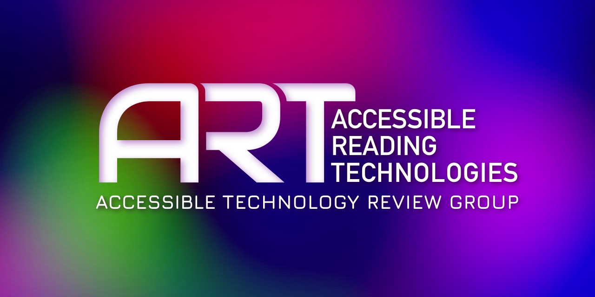

# AccessReview
## Indicate Your Interest
Please [add a post](https://github.com/A11yReadTech/AccessReview/discussions/2) in the discussions area [interest thread](https://github.com/A11yReadTech/AccessReview/discussions/2). We need 5 members to make this an official community group of the W3C.
### Accessible Technology Review Group
This is the GitHub repo of a proposed W3C Community Group, with the idea being to evaluate, discuss, and publish reviews of various accessible technologies, particularly those involving web content.

 

